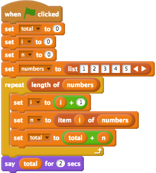

# From Blocks to Text

## UON Computer Science 4 Schools

### Integrating Coding with Math & CS Workshop

#### Presented by Daniel Hickmott

---

# Session Overview

- Presentation for about 20 minutes:
	- Comparing *Blocks* vs *Text* Languages
	- Examples of *Blocks*, *Hybrid* and *Text* Languages
- The rest of the session:
	- Exploring the resources for the different types of Languages

---

# Presentation Overview

- Visual vs General-Purpose Languages
- Blocks vs Text
- Moving from Blocks to Text
- Hybrid Environments
- Introductory Text Languages

---

# Visual vs General-Purpose Languages

- In ACARA Digital Technologies content descriptors:
	-  Years 5 & 6: _"Implement digital solutions as simple **visual programs** involving branching, iteration (repetition), and user input (ACTDIP020)"_
	- Years 7 & 8: _"Implement and modify programs with user interfaces involving branching, iteration and functions in a **general-purpose programming language** (ACTDIP030)"_

---

# Visual vs General-Purpose Languages

- *Visual Programming languages* involve using graphical elements (e.g: blocks) to write programs. The majority of these languages involve dragging and dropping blocks but there are some exceptions (e.g. flowcharts). I will refer to them as *Blocks languages* from now on.
- *General-Purpose Programming languages* are those where programs are (usually) written using text. I will refer to them as *Text languages* from now on.

---

```c
/* Hello World program */

#include<stdio.h>

main()
{
    printf("Hello World");
}
```


---

# Blocks vs Text: Blocks

- Popular in K-12 and used for teaching CS in some Universities
- Are not usually used by professional Engineers and Scientists
- Very popular and a lot of current development / research work is put into creating *Blocks languages*
- *Scratch*, *Snap!*, *LEGO Mindstorms*... you may use others with your students

---
```python

if __name__ == "__main__":
	totl = 0
	i = -1
	numbers = [1,2,3,4
	for i in rang(0, leng(numbers)):
	   i = i + 1
		n = numbers[i]
	total = total + n
	print(total)	

```



---

# Blocks vs Text: Text

- Unlike *Blocks languages*, you have to be more careful about typos and syntax
- These languages are used by professional Engineers and Scientists in industry and research  
- Used to develop the majority of software
- *Java*, *Python*, *C++*, *Swift*… the list goes on

---

# Blocks vs Text: Why Blocks?

- No syntax errors
- Lower cognitive load
- Students can focus on *Computational Thinking*
- Can see all the functions in one place
	- [Scratch blocks](https://scratch.mit.edu/)
	- [Python API documentation](https://docs.python.org/3/library/index.html)

---

# Blocks vs Text: Why Blocks?

- Not just for kids!
- [Scratch](https://scratch.mit.edu/) is used for 2 weeks of a [CS course at Harvard](https://www.youtube.com/watch?v=o4SGkB_8fFs)
- [Unreal Blueprints](https://docs.unrealengine.com/latest/INT/Engine/Blueprints/) can be used to code professional games
- [NetLogo](https://ccl.northwestern.edu/netlogo/) can be used for creating simulations for High School and University Science

---

# Blocks vs Text: Why Text?

- Some cases where *Text languages* may be necessary
- Creating a website with a database (e.g. a Facebook-like website)
- Doing some serious Statistics / Data Science, e.g. with [R](https://www.r-project.org/)
- Coding some *Physical Computing* devices, like [Arduinos](https://www.arduino.cc/)
- Students may want to work in or study Computing after school

---

# Moving from Blocks to Text

- You may: 
	- have students that want to move to *Text languages*
	- want to teach a *Text language* for something a *Block language* cannot do
	- show students that *Text languages* can be approachable for beginners

---

# Hybrid Languages

- Switch between *Blocks* and *Text* in one environment
- Could help as a bridge from *Blocks* to *Text*[^1]
- Some examples are:
	- [PencilCode](http://pencilcode.net/)
	- [Code.org's AppLab](https://code.org/educate/applab)

[^1]: Blanchard, J. (2017, August). Hybrid Environments: A Bridge from Blocks to Text. In Proceedings of the 2017 ACM Conference on International Computing Education Research (pp. 295-296). ACM.

---

# Introductory Text Languages

- Languages that make learning *Text* Coding less complex:
	- [jsLogo](http://www.calormen.com/jslogo/) (Logo)
	- [Khan Academy's Computer Programming](https://www.khanacademy.org/computing/computer-programming) (JavaScript)
	- [Swift Playgrounds](https://www.apple.com/au/swift/playgrounds/) (Swift)
	- [Sonic Pi](http://sonic-pi.net/) (Ruby)
