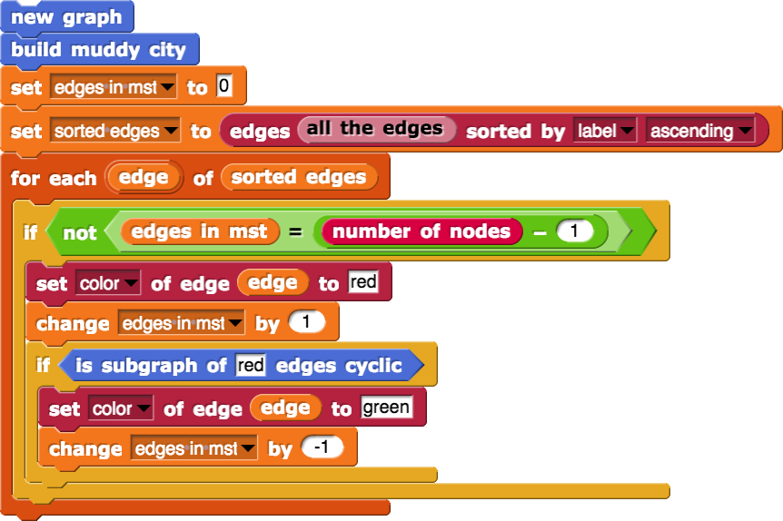
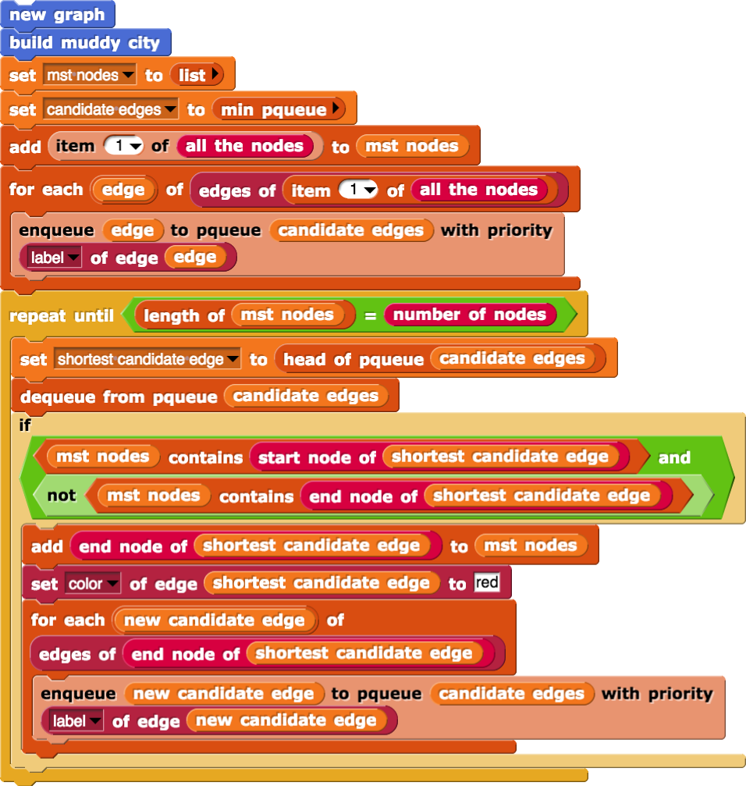
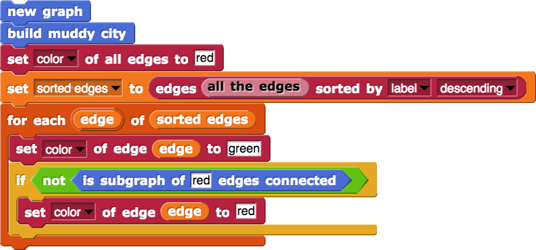

# Finding MSTs in Edgy - Solutions

On this page, we have included pictures of the correctly arranged stacks of blocks for each of the *algorithms* for finding a *Minimum Spanning Tree* in a *Graph*.

## Kruskal's Algorithm

## Prim's Algorithm

## Reverse Deletion Algorithm

