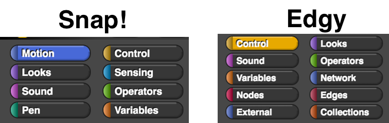
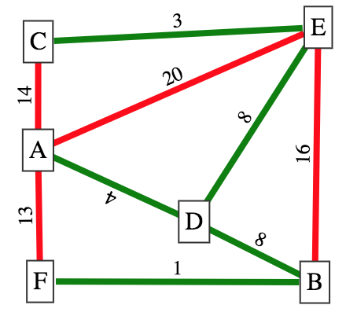

# Creating Networks in Edgy Session

## Introduction to Edgy

### Presented by Daniel Hickmott

---

# Presentation Contents

- What is Edgy?
- Edgy Websites
- Edgy vs Snap!
- Edgy Blocks
- Snap! Cloud Account
- Edgy Examples
- Random, Cyclic & Connected Graphs

---

# What is Edgy?

- A modification for *Snap!*
- Create and manipulate *Graphs* with code blocks
- Piloted in VCE Algorithmics (this subject includes *Graph Theory*)
- Also used in an Undergraduate *Algorithms* course at *Monash*

---

# Edgy Websites

- [Snap Apps: Edgy website](http://www.snap-apps.org/edgy.html)
- [Github: Edgy website](http://snapapps.github.io/)
- [*Programming with Edgy* materials on Alexandria Repository](https://www.alexandriarepository.org/syllabus/programming-with-edgy/)

---

# Edgy vs Snap!

- One *Graph* - instead of multiple *Sprites*
- No *Motion* or *Pen* blocks in *Edgy*

---

# Edgy Blocks

- **Networks**
- **Nodes**
- **Edges**
- **External**
- **Collections**

---

# Snap! Cloud Account

- You can register for a *Cloud Account* to save your *Snap!* projects
- Unfortunately *Edgy* does not allow this
- Can also save projects to:
	- an *XML file* through *File > Export Project*
	- the *Web Browser* through *File > Save*
- We recommend exporting the XML files and keeping them on a USB and/or emailing them to yourself at the end of the day
	
---

# Edgy Examples

- On the [Snap Apps: Edgy website](http://www.snap-apps.org/edgy.html) there are some example *programs* to download
- Can download these as *XML* files
- Includes *Muddy City MST Activity* from Computer Science Unplugged in *Edgy*
- *File > Import...*

---

# Random, Cyclic & Connected Graphs

- In this activity, you will create a *program* that:
	- Creates *random Graphs* for a number of *nodes* and *probability*
	- Checks whether *Sub-Graphs* with coloured *edges* are *connected*
	- Checks whether *Sub-Graphs* with coloured *edges* are *cyclic*
- These *algorithms* will be used in the session for finding MSTs as well

---

# Random, Cyclic & Connected Graphs

- Is GR *connected* and/or *cyclic*?
- Is GG *connected* and/or *cyclic*?

---

# Summary

- In this presentation I have:
	- Introduced you to *Edgy*
	- Explained some of the main differences between *Snap!* and *Edgy*
	- Showed you a few different websites for using and learning *Edgy*
	- Explained the main parts of the *Edgy* interface
- **Any questions?**

