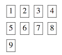
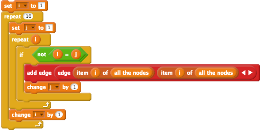
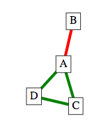

# Networks in Edgy Activity Solutions

## Sequencing in Edgy

### Exercise 1

The *nodes* *A* and *B* will be shaped like circles, but the *node C* will be rectangular shaped.
This is because the *node C* is added to the *Graph* after the *set shape of all nodes to circle* block and consequently that block has no effect on the *node C*.

To make all of the *nodes* shaped like circles, you would have to place the *set shape of all nodes to circle* block after the block that adds the *node C*.
The corrected stack of blocks - which would make *A*,*B* and *C* shaped like circles - is shown in the below image.

### Exercise 2

The *Graph* that results from that stack of blocks is shown in the below image.

The *Graph* is *connected*, because there is a path from every *node* to every other *node*.
The *Graph* is not *cyclic* (acyclic) because there are no *cycles* in the *Graph*.

## Repetition in Edgy

### Exercise 1

The resulting *Graph* will look like the image below.

As you can see, there will be 9 (3 times 3) *nodes* in the *Graph*.

### Exercise 2

The *add edge* block in the inner *repeat* block has a typo in the *edge* that is being added.
Both of the *nodes* in the *edge* to add are the same (*item i of all the nodes*) and consequently *Loop edges* are added to the *Graph*.
Instead the *edge* should connect *item i of all the nodes* and *item j of all the nodes*, so that there is an *edge* between each pair of *nodes*.

The corrected stack of blocks is shown in the image below:

## Randomisation in Edgy

### Exercise 1

The *random Graph* is pictured below.

GR contains the *nodes*: *A*,*B*,*C*,*D* and *E*, and the *edges*: (*A*,*D*) and (*B*,*D*).
GR is *not connected*, because there are no paths with red *edges* to the *nodes*: *C* and *E*.
GR is *acyclic* - it contains no *cycles* of red *edges*.

GG contains the *nodes*: *A*,*B*,*C*,*D* and *E*, and the *edges*: (*A*,*B*), (*A*,*C*), (*A*,*E*) and (*B*,*E*).
GG is *not connected*, because there are no paths with green *edges* from *D* to any of the other *nodes*.
GG is *cyclic*, because it contains a *cycle* of green *edges*: (*A*,*B*), (*B*,*E*) and (*E*,*A*).

### Exercise 2

The other *random Graph* is pictured below.

GR contains the *nodes*: *A*,*B*,*C*,*D* and *E*, and the *edges*: (*A*,*B*),(*B*,*E*),(*B*,*D*) and (*C*,*E*).
GR is *connected*, because there is a path of red *edges* between each of the pairs of *nodes* in the *Sub-Graph*.
GR is *acyclic*, because there are no *cycles* in the *Sub-Graph*.

GG contains the *nodes*: *A*,*B*,*C*,*D* and *E*, and the *edges*: (*A*,*C*),(*A*,*D*),(*A*,*E*) and (*C*,*D*).
GG is *not connected*, because there no paths with green *edges* from *B* to any of the other *nodes*.
GG is *cyclic*, because it contains a *cycle* of green *edges*: (*A*,*C*),(*C*,*D*) and (*D*,*A*).

## Connected Graphs

### Exercise 1

The *Graph* in the *Check Your Understanding* question is shown in the image below:

In the *algorithm* that we have created for finding whether a *Sub-Graph* with certain coloured *edges* is *connected*, it does not matter which *node* the *algorithm* starts from.

If the *algorithm* starts from *B*, then no other *nodes* will be added to the *to visit Stack*, because the only *edge* out of *A* is red. Consequently, only *B* will be in the *visited List* and the *algorithm* will report that the *Graph* is not *connected*.

If, however, the *edge* from *B* to *A* is green - then the *Graph* would be connected and the *algorithm* would report *true*.

## The Random Graph Program

We have included pictures of what all of the blocks in the finished *Random Graph* program will look like.
After completing the *Coding in Snap! Activity*, the blocks in your stack of blocks that follow the *when green flag clicked* block should [look like this image](images/main_stack_of_blocks.png){:target="_blank"}.

The blocks inside the *Block Editor* for the *is subgraph of colour edges connected* block should [look like this image](images/is_subgraph_of_colour_edges_connected.png){:target="_blank"}

The blocks inside the *Block Editor* for the *is subgraph of colour edges cyclic* block should [look like this image](images/is_subgraph_of_colour_edges_cyclic.png){:target="_blank"}
