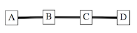
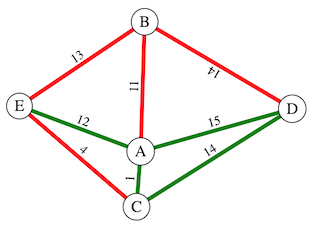

# Networks in Edgy Activity Solutions

## Sequencing in Edgy

### Exercise 1

The *nodes* *A* and *B* will be shaped like circles, but the *node C* will be rectangular shaped.
This is because the *node C* is added to the *Graph* after the *set shape of all nodes to circle* block and consequently that block has no effect on the *node C*.

To make all of the *nodes* shaped like circles, you would have to place the *set shape of all nodes to circle* block after the block that adds the *node C*.
The corrected stack of blocks - which would make *A*,*B* and *C* shaped like circles - is shown in the below image.

### Exercise 2

The *Graph* that results from that stack of blocks is shown in the below image.

The *Graph* is *connected*, because there is a path from every *node* to every other *node*.
The *Graph* is not *cyclic* (acyclic) because there are no *cycles* in the *Graph*.

## Repetition in Edgy

### Exercise 1

The resulting *Graph* will look like the image below.

As you can see, there will be 20 nodes in the *Graph*.

### Exercise 2

The add edge is.. and this is why there is a *Graph* with only loop edges*

The corrected code is:

## Randomisation in Edgy

### Exercise 1

The *random Graph* is pictured below.

GR contains the *nodes*: *A*,*B*,*C*,*D* and *E*, and the *edges*: (*A*,*D*) and (*B*,*D*).
GR is *not connected*, because there are no paths with red *edges* to the *nodes*: *C* and *E*.
GR is *acyclic* - it contains no *cycles* of red *edges*.

GG contains the *nodes*: *A*,*B*,*C*,*D* and *E*, and the *edges*: (*A*,*B*), (*A*,*C*), (*A*,*E*) and (*B*,*E*).
GG is *not connected*, because there are no paths with green *edges* from *D* to any of the other *nodes*.
GG is *cyclic*, because it contains a *cycle* of green *edges*: (*A*,*B*), (*B*,*E*) and (*E*,*A*).

### Exercise 2

The other *random Graph* is pictured below.

GR contains the *nodes*: *A*,*B*,*C*,*D* and *E*, and the *edges*: (*A*,*B*),(*B*,*E*),(*B*,*D*) and (*C*,*E*).
GR is *connected*, because there is a path of red *edges* between each of the pairs of *nodes* in the *Sub-Graph*.
GR is *acyclic*, because there are no *cycles* in the *Sub-Graph*.

GG contains the *nodes*: *A*,*B*,*C*,*D* and *E*, and the *edges*: (*A*,*C*),(*A*,*D*),(*A*,*E*) and (*C*,*D*).
GG is *not connected*, because there no paths with green *edges* from *B* to any of the other *nodes*.
GG is *cyclic*, because it contains a *cycle* of green *edges*: (*A*,*C*),(*C*,*D*) and (*D*,*A*).

## Connected Graphs

### Exercise 1

## Cylic Graphs

## The Random Graph Program

